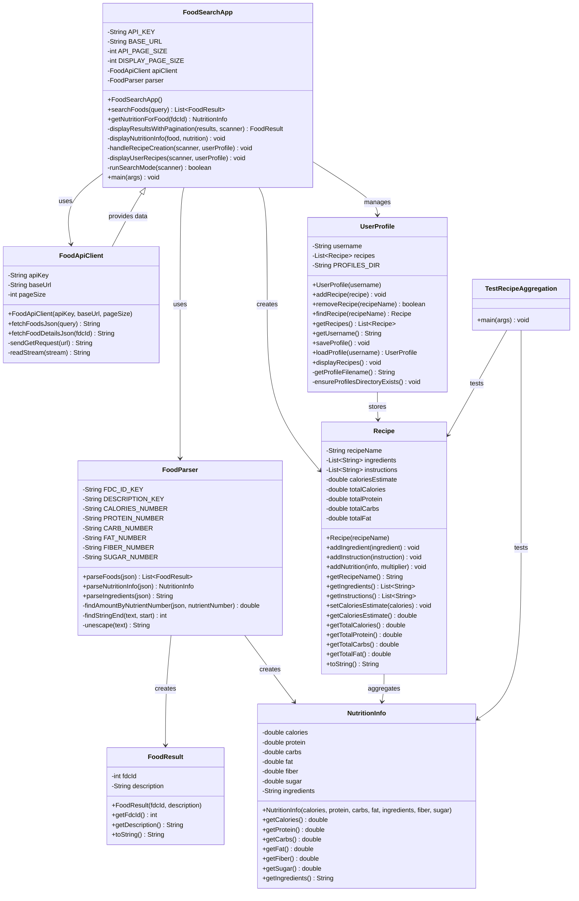

# AP-CSA-FINAL: Food Search & Recipe Management App

Console-based USDA food search app and personal recipe manager for AP CSA.

## Features

### Core Features
- **USDA Food Search**: Search the USDA FoodData Central database for real nutrition data
- **User Profiles**: Create and manage personal accounts with automatic save/load
- **Recipe Management**: Create, save, and organize recipes with ingredients and instructions
- **Nutrition Tracking**: Automatic aggregation of macronutrients from searched foods
- **Persistent Storage**: All user data saved to local text files

### Advanced Features
- **Smart Ingredient Search**: Search USDA database for specific foods and add them to recipes
- **Nutrition Aggregation**: Automatically sum up calories, protein, carbs, fat, fiber, and sugar across multiple recipe ingredients
- **Servings Multiplier**: Specify serving counts (e.g., 0.5, 1, 2.5) to scale nutrition per ingredient
- **Pagination**: Browse search results page-by-page (10 results per page)
- **Rich Nutrition Data**: Extract fiber and sugar in addition to basic macros

## AP CSA Requirements Checklist

- ✅ **Multiple Interacting Classes**: `FoodSearchApp`, `FoodApiClient`, `FoodParser`, `FoodResult`, `Recipe`, `UserProfile`, `NutritionInfo`
- ✅ **Encapsulation**: Private fields with public getters across all classes
- ✅ **ArrayList Usage**: `ArrayList<FoodResult>`, `ArrayList<Recipe>`, `ArrayList<String>` for ingredients and instructions
- ✅ **2D Array**: String tables for pagination display
- ✅ **Working Driver**: Main method in `FoodSearchApp` with menu-driven interface
- ✅ **File I/O**: Recipe and profile persistence using `Files.write()` and `Files.readAllLines()`
- ✅ **Exception Handling**: IOException, NumberFormatException throughout
- ✅ **Loops & Conditionals**: Menu system, pagination, search filtering
- ✅ **Object-Oriented Design**: Inheritance-ready structure, clear separation of concerns

## Architecture Overview



## How to Use

### 1. **Start the Application**
```bash
javac -d bin *.java
java -cp bin FoodSearchApp
```

### 2. **Main Menu**
```
========== MAIN MENU ==========
1. Search Foods
2. Create Recipe
3. View My Recipes
4. Exit
==============================
```

### 3. **Search Foods**
- Enter a food name (e.g., "apple", "chicken breast", "pasta")
- Browse paginated results with `n` (next), `p` (previous), or enter food number
- View nutrition breakdown for selected food

### 4. **Create Recipe** (Mode 1: Manual)
- Enter recipe name
- Add ingredients one by one
- Add cooking instructions step-by-step
- Option to enter estimated calories

### 5. **Create Recipe** (Mode 2: Search-Based)
- Choose option 2 when prompted
- Search USDA database for each ingredient
- Select the food and enter servings (e.g., 0.5, 1, 2)
- Nutrition automatically aggregated into recipe total
- Example:
  ```
  Recipe: Breakfast Bowl
  - 1 x oats, dry
  - 2 x banana, raw
  - 0.5 x milk, whole
  
  Aggregated Nutrition:
  Calories: 342.5 kcal
  Protein:  12.3 g
  Carbs:    58.7 g
  Fat:      8.2 g
  ```

### 6. **View My Recipes**
- See numbered list of all recipes
- Select a recipe to view full details including aggregated nutrition
- Delete recipes as needed

## File Structure

```
/workspaces/AP-CSA-FINAL/
├── README.md                   (This file)
├── FEATURES.md                 (User profile & recipe features)
├── FoodSearchApp.java          (Main application & UI)
├── FoodApiClient.java          (USDA API communication)
├── FoodParser.java             (JSON parsing, nutrient extraction)
├── FoodResult.java             (Search result data class)
├── NutritionInfo.java          (Nutrition data class: macro & micronutrients)
├── Recipe.java                 (Recipe management & nutrition aggregation)
├── UserProfile.java            (User profile & persistence)
├── TestRecipeAggregation.java  (Unit tests)
├── bin/                        (Compiled .class files)
└── user_profiles/              (User recipe storage)
    └── username_recipes.txt    (One file per user)
```

## Data Storage

### User Profile
Each user gets a file like `user_profiles/John_recipes.txt`:
```
=== USER PROFILE ===
Username: John
Number of Recipes: 1

====================
Recipe Name: Breakfast Bowl

Ingredients:
  - 1 x oats, dry
  - 2 x banana, raw
  - 0.5 x milk, whole

Instructions:
  1. Pour oats into bowl
  2. Add milk and stir
  3. Top with banana

Estimated Calories: 342.5 kcal

Aggregated Nutrition:
  Calories: 342.5
  Protein: 12.3 g
  Carbs: 58.7 g
  Fat: 8.2 g
```

## API Integration

This app uses the **USDA FoodData Central API**:
- https://fdc.nal.usda.gov/
- Provides real nutritional data for ~400,000 foods
- Free tier with API key
- Returns JSON with detailed nutrition facts

## Testing

Run the included unit test:
```bash
java -cp bin TestRecipeAggregation
```

Output:
```
All tests passed.
```

The test verifies:
- Nutrition aggregation multiplies correctly
- Missing nutrition values (-1) don't affect totals
- Multiple ingredients combine properly

## Requirements Met

| Requirement | Implementation |
|---|---|
| Multiple Classes | 7 core classes + 1 test class |
| Encapsulation | Private fields with getters/setters |
| ArrayList | Food results, recipes, ingredients, instructions |
| 2D Array | String table for pagination display |
| File I/O | User recipes saved/loaded as text files |
| Exception Handling | IOException, NumberFormatException caught throughout |
| Main Method | FoodSearchApp.main() with menu system |
| Loops | Pagination, menu loops, search filters |
| Conditionals | Menu choices, result filtering, validation |

## Future Enhancements

- Grocery list export from recipes
- Meal planning with weekly calorie targets
- Recipe rating and favoriting system
- Ingredient substitution suggestions
- Integration with fitness tracking APIs
- Barcode scanning for quick ingredient lookup