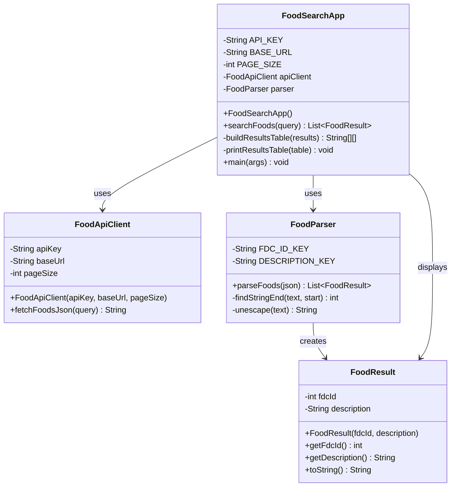

# AP-CSA-FINAL

Console-based USDA food search app for AP CSA.

## AP CSA Requirements Checklist

- Multiple interacting classes: `FoodSearchApp`, `FoodApiClient`, `FoodParser`, `FoodResult`
- Encapsulation: private fields used in all core classes with getters in `FoodResult`
- Array or ArrayList: `ArrayList<FoodResult>` in parser output
- 2D array: `String[][]` table in `FoodSearchApp` for structured result display
- Working driver program: `main` method in `FoodSearchApp`

## Class Diagram



	## Program Flowchart

	```mermaid
	flowchart TD
		A([Start Program]) --> B[Show: Food Search (type 'exit' to quit)]
		B --> C[/User enters search text/]
		C --> D{Input is "exit"?}
		D -- Yes --> Z([End Program])
		D -- No --> E{Input is empty?}
		E -- Yes --> E1[Show: Please enter a food name] --> C
		E -- No --> F[Call searchFoods(query)]

		F --> G{Results found?}
		G -- No --> G1[Show: No matching foods found] --> C
		G -- Yes --> H[Build 2D results table]
		H --> I[Print matching foods]
		I --> J[/User selects food number\n0 = skip/]
		J --> K{Choice is 0?}
		K -- Yes --> C
		K -- No --> L[Get selected FoodResult]
		L --> M[Call getNutritionForFood(fdcId)]
		M --> N[Print calories, protein, carbs, fat]
		N --> C
	```