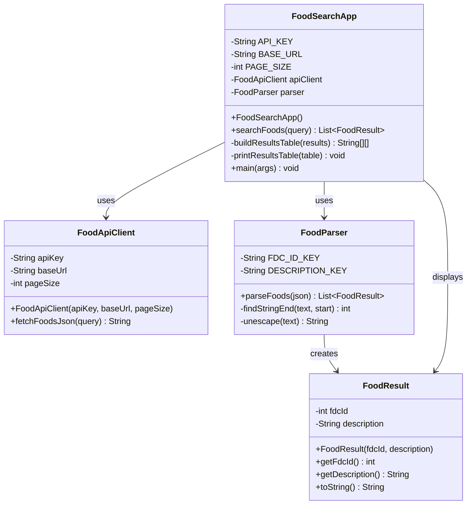

# AP-CSA-FINAL

Console-based USDA food search app for AP CSA.

## AP CSA Requirements Checklist

- Multiple interacting classes: `FoodSearchApp`, `FoodApiClient`, `FoodParser`, `FoodResult`
- Encapsulation: private fields used in all core classes with getters in `FoodResult`
- Array or ArrayList: `ArrayList<FoodResult>` in parser output
- 2D array: `String[][]` table in `FoodSearchApp` for structured result display
- Working driver program: `main` method in `FoodSearchApp`

## Class Diagram

